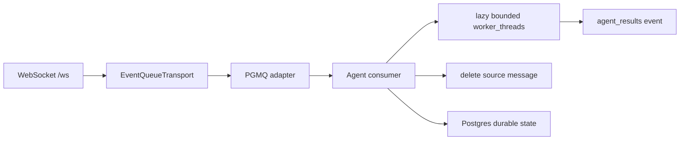

# Architecture

The replacement plan and its event-store, attempt, replay, and migration contracts live in [Agent Renewal plan](../../../agentRenewal.md). Update this router with the implementing source path and a code-to-document anchor in the same phase that changes a contract.

The `admin` Compose service owns the PostgreSQL/PGMQ runtime. The agent separates durable-state Postgres, ingress long-poll, and queue-writer pools. PGMQ is the current `EventQueueTransport` adapter, not the consumer contract. Ingress lanes durably append a canonical envelope and insert its processing job before deleting the source message; scheduler lanes alone claim jobs and dispatch bounded CPU work. An empty queue keeps the worker pool at zero; `AGENT_MAX_THREADS` is an explicit upper bound.

The preserved baseline branch had a duplicate/conflict early-return defect that could stop consumption. The current Renewal branch continues to the next message after acknowledging a conflict; the old branch remains reference/recovery material, not an operational fallback. See the [Agent Renewal plan](../../../agentRenewal.md).

| Source path | Responsibility |
| --- | --- |
| `src/server/app.ts` | HTTP ingress, health/readiness, token-guarded metrics |
| `src/server/database.ts` | explicit durable-state Postgres pool construction |
| `src/server/queue` | queue transport contract independent of a broker |
| `src/server/pgmq` | PostgreSQL/PGMQ adapter |
| `src/server/consumer.ts` | ingress handoff plus the sole durable-job scheduler/worker dispatcher |
| `src/server/processing` | durable processing jobs, lease claim, heartbeat renewal, retry handoff |
| `src/server/ingress` | legacy queue event to canonical draft conversion and result derivation |
| `src/server/event-store` | immutable canonical event persistence, per-stream positions, identity backfill |
| `src/server/outbox` | transactionally reserved terminal egress and fenced dispatcher |
| `src/server/projection` | independent session/run/turn/tool CQRS views and checkpoints |
| `src/server/execution` | transaction-key idempotency state |
| `src/server/metrics` | aggregate operator counters behind `GET /metrics` |
| `src/server/worker` | lazy bounded Worker Thread pool and allow-listed actions |
| `src/server/stream` | channel-filtered WebSocket event projection |
| `src/server/transport/websocket.ts` | `/ws` subscribe and event frames |
| `src/front` | minimal service shell |

