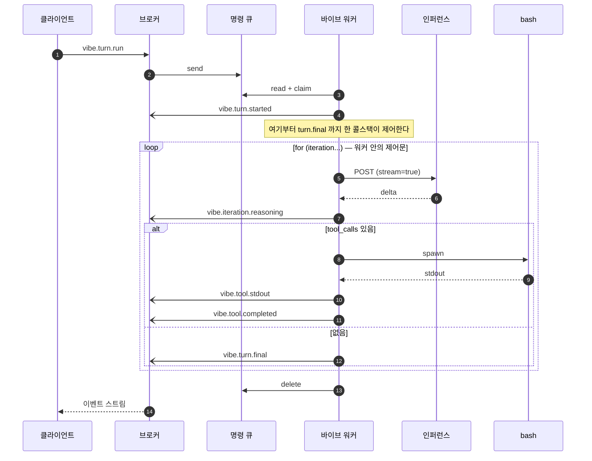
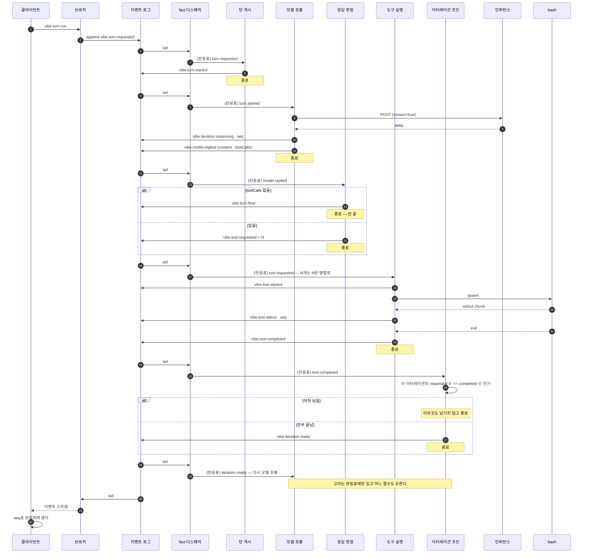

# 턴 하나가 오가는 이벤트 시퀀스

한 세션 안에서 턴이 반복되는 과정을, 클라이언트 · 워커 · 도구 프로세스 · 인퍼런스 서비스
사이에 오가는 이벤트로 본 것이다.

## 규칙

> **모든 워커는 다른 워커를 모른다. 이벤트로만 대화한다.**

이 한 줄이 나머지를 전부 결정한다. 따라서:

- 워커는 **일어난 일(fact)** 만 남긴다. "다음에 이걸 해라" 를 남기지 않는다.
  "다음에 이걸 해라" 를 쓸 수 있는 순간 그 워커는 다음 워커가 누구인지 알게 된다.
- 어떤 fact에 어떤 반응기가 붙는지는 **반응표** 가 정한다. 표는 앱의 설정이고,
  워커도 브로커도 그것을 모른다.
- 반복도 분기도 어느 함수 안에 없다. fact가 fact를 부르는 고리로만 존재하고,
  그 고리를 아는 함수는 하나도 없다.
- 필요한 상태가 있으면 **상태 객체를 인자로 공급받을 뿐이다.** 컨텍스트는 상태이지
  점유물이 아니다.
- **워커는 자기 임무가 걸리는 만큼 살아 있어도 된다.** 스트림을 30초 붙드는 인퍼런스
  워커도, 자식 프로세스가 끝날 때까지 기다리는 도구 워커도 정당하다. 그것이 그 함수의
  단일 임무이기 때문이다. 금지되는 것은 길게 사는 것이 아니라 **자기 역할 밖의 제어를
  하려고** 살아 있는 것이다. 지금의 `runTurn` 이 정확히 후자다 — 루프를 돌리려고
  살아 있고, 그래서 아무도 끼어들 수 없다.

이 둘을 가르는 질문은 하나다. **이 함수가 죽으면 무엇을 다시 해야 하는가.**
자기 임무 하나면 정상이고, 남의 진행 상황까지면 제어를 쥐고 있는 것이다.

이 규칙의 실질적인 결과가 하나 있고, 그것이 설계가 맞다는 신호다. 워커가 fact만
남긴다면 **핸들러 계약에 더할 것이 없다.** `emit` 이 이미 로그에 fact를 적는다.
"다음 명령을 큐에 넣는 기능" 을 핸들러에 주려던 것은 결합을 만드는 물건이었다.

## 참가자

| 참가자 | 하는 일 |
| --- | --- |
| 클라이언트 | 이벤트를 보내고, 받은 이벤트를 화면 상태로 접는다 |
| 이벤트 브로커 | 소켓과 로그 tail. 아무 처리도 하지 않는다 |
| 이벤트 로그 | `event_store`. append만 되고 지워지지 않는다 |
| **fact 디스패처** | 로그를 tail하며 반응표대로 반응기 큐에 넣는다. 도메인을 모른다 |
| 반응기 큐 | 종류별 PGMQ 큐. 하나를 정확히 한 워커가 소유한다 |
| 워커 | fact 하나에 반응하는 **독립 함수를 한 번 실행**하고 끝난다 |
| 인퍼런스 | OpenAI 호환 엔드포인트. SSE로 스트리밍한다 |
| bash | 별도 OS 프로세스 |

---

## 1. 지금 도는 것 — 한 함수가 흐름을 쥐고 있다

문제는 시간이 아니라 제어다. `for` 와 `if` 가 한 함수 안에 있는 한 — 중간에 끼어들 수
없고, 죽으면 턴 전체를 다시 하고, 다음 단계를 다른 워커가 이어받을 수 없다.

---

## 2. 가야 할 곳 — 아무도 다음을 지목하지 않는다

각 워커는 **자기가 반응하는 fact 하나**를 받아 실행하고, **일어난 일을 fact로 남기고**
끝난다. 화살표가 워커에서 워커로 가지 않는다. 전부 로그를 거쳐 디스패처가 옮긴다.

### 반응표 — 유일하게 고리를 아는 것

앱의 설정이다. 워커도 브로커도 디스패처도 이 표의 **의미**를 모른다.
디스패처는 "이 action이면 이 큐들" 만 본다.

| fact | 반응기 큐 |
| --- | --- |
| `vibe.turn.requested` | 턴 개시 |
| `vibe.turn.started` | 모델 호출 |
| `vibe.model.replied` | 응답 판정 |
| `vibe.tool.requested` | 도구 실행 |
| `vibe.tool.completed` | 이터레이션 조인 |
| `vibe.iteration.ready` | 모델 호출 |
| (전부) | 뷰 투영 |

한 fact를 여러 반응기가 받아도 된다. 큐가 다르므로 경쟁 소비가 아니다.

### 함수마다 하는 일 하나

| 함수 | 반응하는 fact | 하는 일 | 남기는 fact |
| --- | --- | --- | --- |
| 턴 개시 | `turn.requested` | 턴이 시작됐음을 기록 | `turn.started` |
| 모델 호출 | `turn.started`, `iteration.ready` | 컨텍스트를 로그에서 접고 모델을 부른다 | 델타들, `model.replied` |
| 응답 판정 | `model.replied` | 최종인지 도구인지 본다 | `turn.final` 또는 `tool.requested × N` |
| 도구 실행 | `tool.requested` | 프로세스를 띄우고 출력을 중계 | `tool.started/stdout/completed` |
| 이터레이션 조인 | `tool.completed` | 요청 수와 완료 수를 센다 | 전부 끝났으면 `iteration.ready` |
| 뷰 투영 | 전부 | 묶어서 뷰 테이블에 기록 | 없음 |

**조인에 제어자가 없다.** 도구 호출이 N개면 `tool.completed` 가 N번 오고 조인 함수가
N번 깨어난다. 매번 같은 질문 — "이 이터레이션이 요청한 수만큼 끝났는가" — 을 로그에
물어보고, 마지막 하나만 참을 만난다. 세는 일은 상태가 하지 누가 지휘하지 않는다.

### 이 모양이 아니면 얻을 수 없는 것

| | 제어를 쥔 워커 | 반응형 함수들 |
| --- | --- | --- |
| 도구 승인 게이트 | 불가 | `tool.requested` 와 도구 실행 사이에 반응기를 하나 더 끼운다. 기존 함수는 손대지 않는다 |
| 턴 취소 | 불가 | 다음 fact가 남지 않으면 끝난다 |
| 재개 | 턴 전체 재실행 | 마지막 fact를 다시 흘리면 그 지점부터 |
| 워커 사망 | 턴 전체 소실 | 그 함수 한 번만 다시 |
| 다중 도구 호출 | 루프 안에서 순차 | N개가 그냥 병렬로 흐른다 |
| 스케일 | 턴 단위 | 함수 종류별. 느린 종류만 늘린다 |
| 새 기능 | 기존 함수를 고친다 | 반응표에 한 줄, 파일 하나 |

---

## 3. 뷰 테이블도 같은 규칙으로 붙는다

턴이 쌓이면 브라우저가 전부 들고 있을 수 없다. 끝난 턴은 접고 내용을 버린 뒤 다시 펼칠 때
백엔드에서 받아온다. 그 조회는 이미 DB에 있는 것을 읽는 일이므로 HTTP다.

원본 로그를 매번 접는 것보다 미리 묶어 둔 뷰를 읽는 편이 싸고, 그 묶는 일이 뷰 투영
함수의 몫이다. **바쁜 처리 함수에 DB 쓰기를 얹지 않는다** — 함수 하나가 하는 일은 하나다.

디스패처가 있으므로 이것은 반응표에 한 줄 추가하는 일이지, 누구를 고치는 일이 아니다.
"이벤트를 옆에서 주워 담는" 문제도 사라진다. 뷰 함수는 자기 큐에서 자기 사본을 받는다.

---

## 4. 이 시퀀스가 지키는 규칙

- **다른 워커를 아는 워커가 없다.** fact만 남기고, 연결은 반응표에만 있다.
- **컨텍스트는 상태일 뿐이다.** 필요한 상태 객체를 인자로 공급받을 뿐, 아무것도 점유하지 않는다.
- **순서는 큐가 아니라 인과와 시퀀스가 보장한다.** 다음 fact는 앞 fact를 처리한 뒤에야 남고,
  한 함수가 쏟아내는 관측은 발행자가 번호를 붙여 각 수신자가 제자리에 끼워 넣는다.
- **응답을 기다리지 않는다.** fact를 남기고 그 처리를 기다리는 함수는 없다.
- **이벤트는 불변이다.** 그래서 로그를 여럿이 읽어도 서로를 막지 않는다.

---

## 5. 지금과의 거리

| | 상태 |
| --- | --- |
| 턴 개시 · 모델 호출 · 판정 · 도구 실행 · 조인 | **하나의 함수 안에 `for` 로 묶여 있다** |
| 워커 라우터 (`router[action]`) | 있음. 등록된 것은 `session.open`, `turn.run` 둘 |
| 상태 객체 주입 | 있음 |
| 로그에서 컨텍스트 재구성 | 폴더만. 대화 `messages[]` 는 콜스택 안에 있다 |
| **fact 디스패처와 반응표** | **없음. 이것이 먼저다** |
| 반응기별 큐 | 없음. 명령 큐 하나뿐 |
| 브로커의 ingress → 로그 append | 없음. 지금은 큐에 바로 넣는다 |
| 뷰 테이블 · 뷰 함수 | 없음 |

디스패처가 없으면 나머지가 전부 불가능하므로 그것이 첫 번째다. 그리고 디스패처가
반응기 큐에 넣는 것과 fact를 로그에 적는 것 사이에서 죽어도 되게 만들어야 한다 —
디스패처는 자기 tail 위치만 들고 있고 넣기는 at-least-once이므로, 중복 투입은
반응기의 execution claim이 흡수한다. claim 키는 fact의 `eventId` 에서 결정적으로 만든다.
