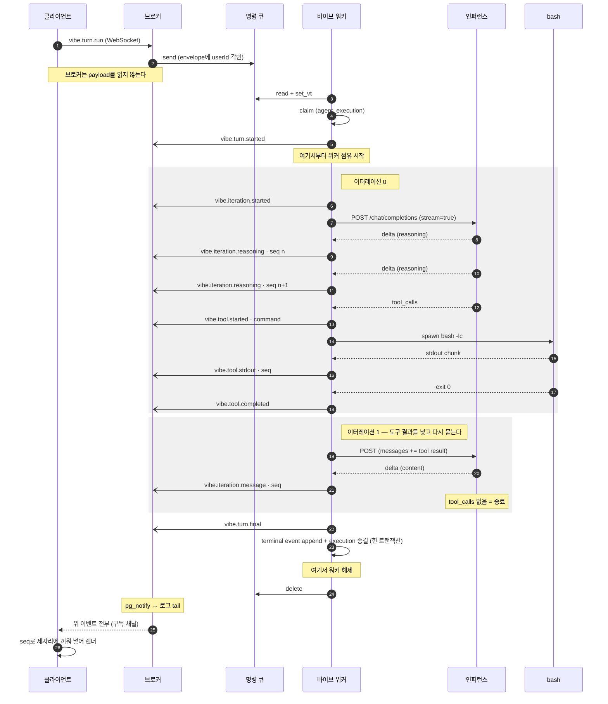
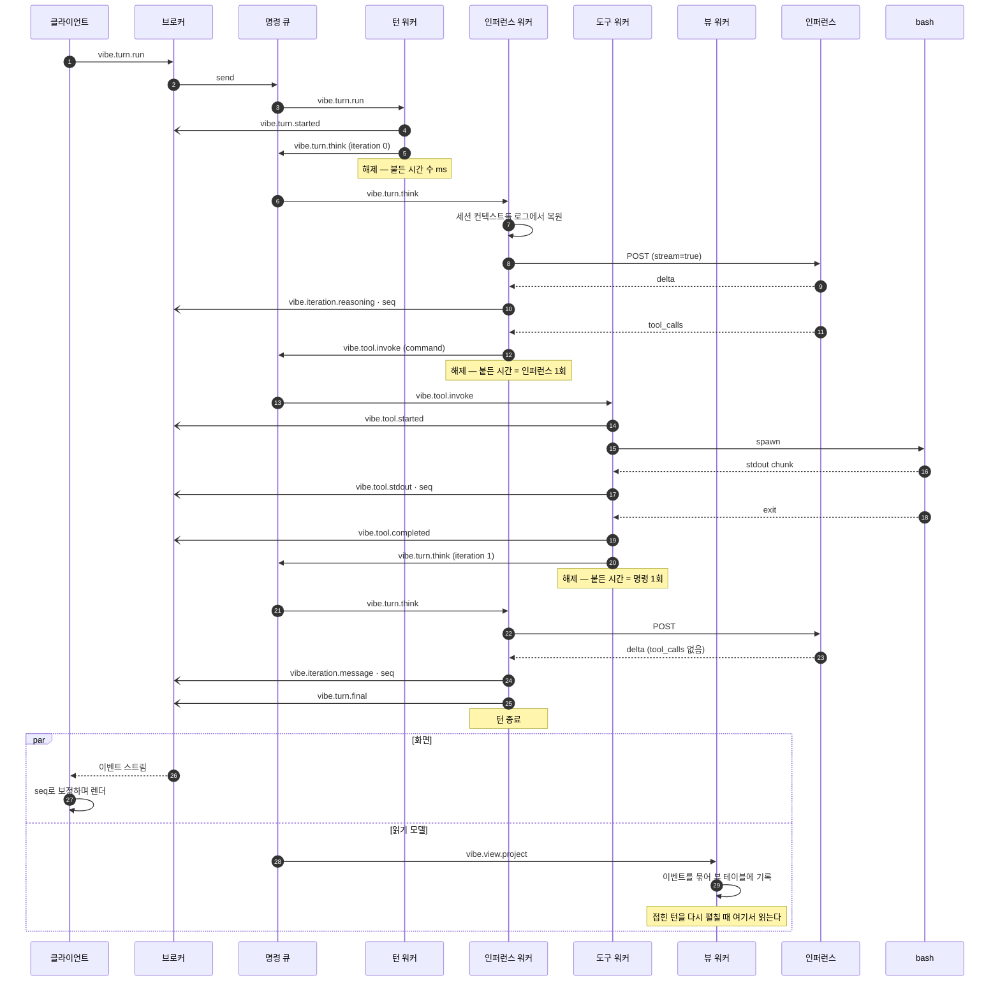

# 턴 하나가 오가는 이벤트 시퀀스

한 세션 안에서 턴이 반복되는 과정을, 클라이언트 · 워커 · 도구 프로세스 · 인퍼런스 서비스
사이에 오가는 이벤트로 본 것이다.

두 가지를 나란히 적는다. **지금 도는 것**과 **목표하는 분해**다. 둘의 차이는 하나뿐이고
그것이 전부다 — 워커가 언제 풀려나는가.

## 참가자

| 참가자 | 하는 일 |
| --- | --- |
| 클라이언트 | 이벤트를 보내고 받은 이벤트를 화면 상태로 접는다 |
| 이벤트 브로커 | 소켓과 로그 tail. 아무 처리도 하지 않는다 |
| 명령 큐 | `agent_requests`. 일감을 정확히 한 워커에게 준다 |
| 이벤트 로그 | `event_store`. append만 되고 지워지지 않는다 |
| 바이브 워커 | 턴을 실행한다 |
| 인퍼런스 | OpenAI 호환 엔드포인트. SSE로 스트리밍한다 |
| bash | 별도 OS 프로세스 |

---

## 1. 지금 도는 것

워커가 `claim`한 순간부터 `turn.final`까지 **턴 전체를 붙들고** 있다.
아래에서 `Note over 워커` 구간이 그 점유다.

`-)` 로 그린 화살표는 **대기하지 않는 발행**이다. 워커는 이벤트를 적고 기다리지 않는다.
실제로 대기하는 곳은 두 군데뿐이다 — 인퍼런스 응답과 bash 종료.

### 지금 구조에서 워커가 붙들려 있는 시간

| 구간 | 붙드는 것 | 실측 감각 |
| --- | --- | --- |
| 인퍼런스 | 워커 1개 | 이터레이션당 수 초 ~ 30초 |
| bash | 워커 1개 | 명령당 15ms ~ 120초 |
| 이벤트 append | 붙들지 않음 | await하지 않는다 |

인라인 실행이라 워커 하나가 이벤트 루프를 막지는 않는다(동시 256턴). 하지만
**턴 하나는 처음부터 끝까지 한 프로세스에 묶여 있다.** 중간에 끼어들 수 없고,
죽으면 턴 전체를 다시 하고, 다른 워커가 이어받을 수 없다.

---

## 2. 목표하는 분해

같은 턴을, 단계마다 이벤트로 끊는다. 각 워커는 자기 몫 하나만 하고 **즉시 풀려난다.**

### 무엇이 달라지는가

| | 지금 | 목표 |
| --- | --- | --- |
| 한 워커가 붙드는 최대 시간 | 턴 전체 | 인퍼런스 1회 또는 명령 1회 |
| 턴 중간 개입 | 불가 | 다음 command를 발행하지 않으면 멈춤 = 취소·승인 게이트 |
| 워커 사망 시 | 턴 전체 재실행 | 그 스텝만 재실행 |
| 도구 실행 | 턴 워커가 직접 | 전용 워커. 프로세스 관리가 한 곳에 모인다 |
| 뷰 테이블 | 없음 | 전용 워커가 별도 이벤트를 소비해 기록 |
| 스케일 | 턴 단위 | 스텝 단위. 느린 종류만 따로 늘린다 |

### 왜 뷰 워커를 따로 두는가

PGMQ의 명령 큐는 **하나의 메시지를 하나의 워커가 소유**하도록 되어 있다. 그러므로
"오가는 이벤트를 옆에서 주워 담는" 워커는 그 큐로는 만들 수 없다 — 주워 담는 순간
원래 처리자가 그 메시지를 못 받는다.

두 가지 길이 있고, 후자를 택한다.

1. **턴 워커가 뷰 테이블까지 쓴다** — 이벤트를 이미 손에 들고 있으니 가장 짧은 경로다.
   하지만 인퍼런스와 bash를 상대하느라 바쁜 워커에 DB 쓰기를 더 얹는 것이고,
   "빨리 풀려난다"는 목표와 정면으로 어긋난다.
2. **뷰용 이벤트를 따로 발행한다** — 처리 워커는 `vibe.view.project` 를 큐에 넣고 끝낸다.
   뷰 워커가 그것을 소유해서 묶고 기록한다. 큐의 단일 소유 성질을 거스르지 않고,
   바쁜 워커에 부하를 더하지 않는다.

### 뷰 테이블이 필요한 이유

턴이 쌓이면 브라우저가 전부 들고 있을 수 없다. 끝난 턴과 이터레이션은 접고 **내용을 버린 뒤**,
다시 펼칠 때 백엔드에서 받아오는 편이 낫다. 그 조회는 이미 DB에 있는 것을 읽는 일이므로
HTTP로 처리할 수 있다 — 에이전트 대화가 아니라 기록 조회다.

원본 로그를 매번 접는 것보다 미리 묶어 둔 뷰를 읽는 편이 싸고, 그 묶는 일이 뷰 워커의 몫이다.

---

## 3. 이 시퀀스가 지키는 규칙

- **순서는 큐가 아니라 인과와 시퀀스가 보장한다.** 다음 command는 앞 이벤트를 처리한 뒤에야
  발행되고, 한 핸들러가 쏟아내는 관측(추론 델타, stdout 청크)은 발행자가 번호를 붙여
  각 수신자가 제자리에 끼워 넣는다.
- **응답을 기다리지 않는다.** 위 다이어그램의 `-)` 는 전부 발행이고, 워커는 그 완료를
  await하지 않는다.
- **이벤트는 불변이다.** 그래서 브로커가 여럿이어도 서로를 막지 않고 각자 로그를 따라 읽는다.
- **상태는 양끝에 있다.** 워커의 세션 컨텍스트와 클라이언트의 스냅샷이 각각 로그를 접은 것이고,
  브로커는 아무것도 들지 않는다.
