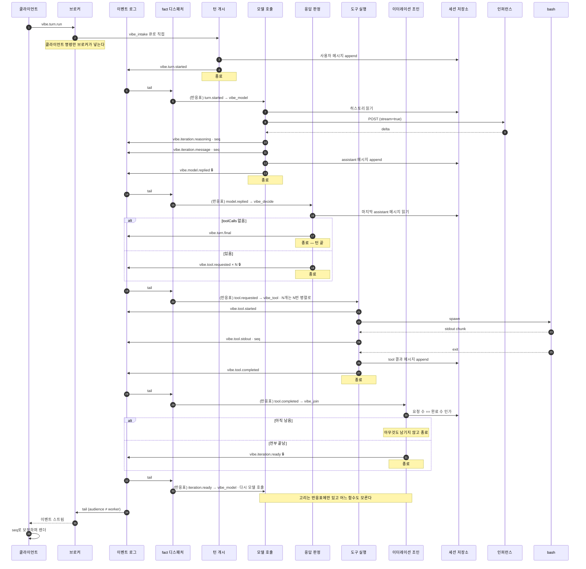

# 턴 하나가 오가는 이벤트 시퀀스

한 세션 안에서 턴이 도는 과정을, 클라이언트 · 반응기 · 도구 프로세스 · 인퍼런스 서비스
사이에 오가는 이벤트로 본 것이다.

## 규칙

> **모든 워커는 다른 워커를 모른다. 이벤트로만 대화한다.**

이 한 줄이 나머지를 전부 결정한다.

- 반응기는 **일어난 일(fact)** 만 남긴다. "다음에 이걸 해라" 를 남기지 않는다.
  그것을 쓸 수 있는 순간 그 반응기는 다음 반응기가 누구인지 알게 된다.
- 어떤 fact에 어떤 반응기가 붙는지는 [**반응표**](#반응표--유일하게-고리를-아는-것)가
  정한다. 표는 앱의 설정이고, 반응기도 브로커도 디스패처도 그 의미를 모른다.
- 반복도 분기도 어느 함수 안에 없다. fact가 fact를 부르는 고리로만 존재하고, 그 고리를
  아는 함수는 하나도 없다.
- 필요한 상태는 **인자로 공급받을 뿐이다.** 컨텍스트는 상태이지 점유물이 아니다.
- **반응기는 자기 임무가 걸리는 만큼 살아 있어도 된다.** 스트림을 30초 붙드는 모델 호출도,
  자식 프로세스를 기다리는 도구 실행도 정당하다. 금지되는 것은 길게 사는 것이 아니라
  **자기 역할 밖의 제어를 하려고** 살아 있는 것이다.

이 둘을 가르는 질문은 하나다. **이 함수가 죽으면 무엇을 다시 해야 하는가.**
자기 임무 하나면 정상이고, 남의 진행 상황까지면 제어를 쥐고 있는 것이다.

## 참가자

| 참가자 | 하는 일 |
| --- | --- |
| 클라이언트 | 명령을 보내고, 받은 fact를 화면 상태로 접는다 |
| 이벤트 브로커 | 소켓과 로그 tail. 아무 처리도 하지 않는다 |
| 이벤트 로그 | `event_store`. append만 되고 지워지지 않는다 |
| fact 디스패처 | 로그를 tail하며 반응표대로 반응기 큐에 사본을 넣는다. 도메인을 모른다 |
| 반응기 큐 | `vibe_intake` · `vibe_model` · `vibe_decide` · `vibe_tool` · `vibe_join` |
| 반응기 | fact 하나에 반응하는 **독립 함수를 한 번 실행**하고 끝난다 |
| 세션 저장소 | `vibe_session` · `vibe_session_message`. 히스토리와 시퀀스의 단일 출처 |
| 인퍼런스 | OpenAI 호환 엔드포인트. SSE로 스트리밍한다 |
| bash | 별도 OS 프로세스 |

---

## 턴 하나

화살표가 반응기에서 반응기로 가지 않는다. 전부 로그를 거쳐 디스패처가 옮긴다.

🔒 는 `audience: "worker"` 로 기록되는 fact다. 브로커의 클라이언트 채널 질의가
`audience <> 'worker'` 로 거르므로 이 셋은 소켓에 실리지 않는다. 채널을 나눈 것이 아니라
같은 로그를 샤딩한 것이다.

**클라이언트 명령만 브로커가 큐에 넣는다.** `vibe.turn.run` 과 `vibe.session.open` 은
브로커의 ingress가 `vibe_intake` 로 보낸다. 그 뒤로는 전부 디스패처가 옮긴다.

---

## 반응표 — 유일하게 고리를 아는 것

앱의 설정이다([`reactions.ts`](../src/server/reactions.ts)). 디스패처는 "이 action이면
이 큐들" 만 본다.

| fact | 반응기 큐 |
| --- | --- |
| `vibe.turn.started` | `vibe_model` |
| `vibe.iteration.ready` | `vibe_model` |
| `vibe.model.replied` | `vibe_decide` |
| `vibe.tool.requested` | `vibe_tool` |
| `vibe.tool.completed` | `vibe_join` |

한 fact를 여러 반응기가 받아도 된다. 큐가 다르므로 경쟁 소비가 아니라 fan-out이다.

## 함수마다 하는 일 하나

| 파일 | 반응하는 fact | 하는 일 | 남기는 fact |
| --- | --- | --- | --- |
| [`session-open.ts`](../../../packages/vibeagent_domain/src/server/reactors/session-open.ts) | `session.open` | 폴더를 확정하고 세션 행을 연다 | `session.opened` |
| [`turn-open.ts`](../../../packages/vibeagent_domain/src/server/reactors/turn-open.ts) | `turn.run` | 프롬프트를 히스토리에 넣는다 | `turn.started` |
| [`model-call.ts`](../../../packages/vibeagent_domain/src/server/reactors/model-call.ts) | `turn.started`, `iteration.ready` | 히스토리를 읽어 모델을 부르고 스트림을 중계 | 델타들, `model.replied` |
| [`reply-decide.ts`](../../../packages/vibeagent_domain/src/server/reactors/reply-decide.ts) | `model.replied` | 최종인지 도구인지 본다 | `turn.final` 또는 `tool.requested × N` |
| [`tool-run.ts`](../../../packages/vibeagent_domain/src/server/reactors/tool-run.ts) | `tool.requested` | 프로세스를 띄우고 출력을 중계 | `tool.started/stdout/completed` |
| [`tool-join.ts`](../../../packages/vibeagent_domain/src/server/reactors/tool-join.ts) | `tool.completed` | 요청 수와 완료 수를 센다 | 전부 끝났으면 `iteration.ready` |

**조인에 제어자가 없다.** 도구 호출이 N개면 `tool.completed` 가 N번 오고 조인 함수가
N번 깨어난다. 매번 같은 질문 — "이 이터레이션이 요청한 수만큼 끝났는가" — 을 DB에
물어보고, 마지막 하나만 참을 만난다. 세는 일은 상태가 하지 누가 지휘하지 않는다.

`session-open` 만 세션 핸들 없이 실행된다. 폴더가 정해지기 전이므로 줄 것이 없다.
나머지는 전부 세션이 이미 폴더를 가진 상태에서만 깨어난다.

---

## 상태는 DB에 있다

반응기들이 서로 다른 프로세스에서 도는 이상, 인메모리 컨텍스트는 경합이다.
세션 상태는 두 테이블에 있다.

| 테이블 | 담는 것 |
| --- | --- |
| `vibe_session` | `session_key`, `workspace`(불변), `next_seq` |
| `vibe_session_message` | `(session_key, ordinal)` 로 정렬된 대화 히스토리 |

- **폴더 불변성**: `INSERT ... ON CONFLICT DO NOTHING` 뒤에 읽는다. 두 번째 개설 시도는
  거부가 아니라 이미 정해진 폴더를 돌려받는다.
- **히스토리 append**: `BEGIN` → 세션 행 `FOR UPDATE` → `max(ordinal)+1`. 한 세션의
  순번은 몇 개의 워커가 붙든 일관된다.
- **시퀀스**: `UPDATE ... next_seq + $2 RETURNING next_seq - $2` 로 블록(8192)을 떼어
  간다. 스트림 델타마다 DB를 왕복하지 않으면서 번호는 겹치지 않는다.
- **조인 판정**: `sum(jsonb_array_length(tool_calls))` 대 `count(*) FILTER (role='tool')`.
  세는 주체가 DB이므로 조인 함수는 상태를 들고 있지 않아도 된다.

"도구 호출 결과를 모델에게 돌려준다" 는 개념일 뿐이다. 실제로는 히스토리에 한 줄이
쌓이고, 다음 모델 호출이 그것을 포함해 읽을 뿐이다.

---

## 순서

큐는 순서를 약속하지 않는다. 두 가지가 대신한다.

- **인과**: 다음 fact는 앞 fact를 처리한 뒤에야 남는다. `iteration.ready` 가 없으면
  다음 모델 호출도 없다. 이것이 단계 사이의 순서 전부다.
- **시퀀스**: 한 함수가 쏟아내는 관측 — 스트림 델타, stdout 조각 — 은 인과 사슬이
  아니라 다발이다. 발행자가 `seq` 를 붙이고 수신자가 제자리에 끼워 넣는다.
  클라이언트는 늦게 온 델타를 버리지 않고 `seq` 로 정렬해 보정한다.

---

## 이 시퀀스가 지키는 규칙

- **다른 워커를 아는 워커가 없다.** fact만 남기고, 연결은 반응표에만 있다.
- **컨텍스트는 상태일 뿐이다.** 인자로 공급받을 뿐 아무것도 점유하지 않는다.
- **순서는 큐가 아니라 인과와 시퀀스가 보장한다.**
- **응답을 기다리지 않는다.** fact를 남기고 그 처리를 기다리는 함수는 없다.
- **이벤트는 불변이다.** 그래서 로그를 여럿이 읽어도 서로를 막지 않는다.

## 이 모양이 아니면 얻을 수 없는 것

| | 제어를 쥔 워커 | 반응형 함수들 |
| --- | --- | --- |
| 도구 승인 게이트 | 불가 | `tool.requested` 와 도구 실행 사이에 반응기를 하나 더 끼운다. 기존 함수는 손대지 않는다 |
| 턴 취소 | 불가 | 다음 fact가 남지 않으면 끝난다 |
| 재개 | 턴 전체 재실행 | 마지막 fact를 다시 흘리면 그 지점부터 |
| 워커 사망 | 턴 전체 소실 | 그 함수 한 번만 다시 |
| 다중 도구 호출 | 루프 안에서 순차 | N개가 그냥 병렬로 흐른다 |
| 스케일 | 턴 단위 | 함수 종류별. 느린 종류만 늘린다 |
| 새 기능 | 기존 함수를 고친다 | 반응표에 한 줄, 파일 하나 |

---

## 아직 없는 것

**뷰 투영.** 턴이 쌓이면 브라우저가 전부 들고 있을 수 없다. 끝난 턴은 접고 내용을 버린 뒤
다시 펼칠 때 백엔드에서 받아오는 편이 낫고, 그 조회는 이미 DB에 있는 것을 읽는 일이므로
HTTP다. 원본 로그를 매번 접는 것보다 미리 묶어 둔 뷰가 싸다.

디스패처가 있으므로 이것은 반응표에 `(전부) → 뷰 투영` 한 줄을 더하고 파일 하나를
쓰는 일이다. 누구를 고치는 일이 아니고, "이벤트를 옆에서 주워 담는" 문제도 없다.
뷰 함수는 자기 큐에서 자기 사본을 받는다. **바쁜 처리 함수에 DB 쓰기를 얹지 않는다.**

**디스패처 재시작 중 비행 중이던 fact.** 커서가 없으면 디스패처는 로그 끝에서 시작한다.
과거를 재생하지 않기 위한 선택이고, 그 대가로 재시작 직전에 기록된 fact는 읽히지 않는다.
지금은 "이미 끝난 턴" 과 "끝내지 못한 턴" 을 구분하지 못한다.
실측은 [검증 리포트](../tests/reports/reactor-decomposition/)에 있다.
