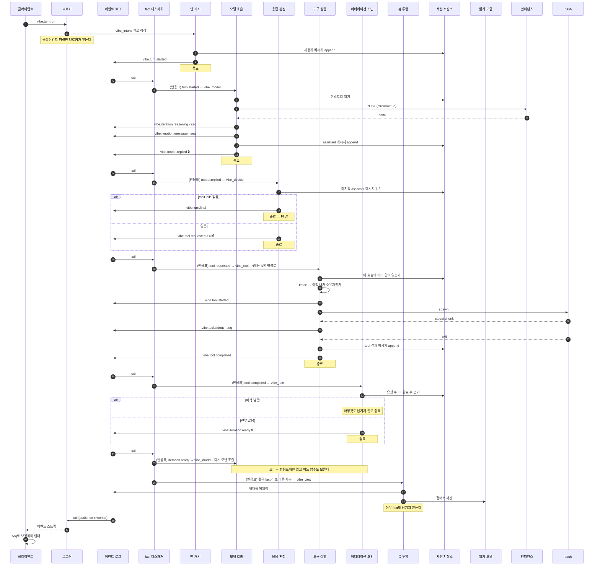

# 턴 하나가 오가는 이벤트 시퀀스

한 세션 안에서 턴이 도는 과정을, 클라이언트 · 반응기 · 도구 프로세스 · 인퍼런스 서비스
사이에 오가는 이벤트로 본 것이다.

## 규칙

> **모든 워커는 다른 워커를 모른다. 이벤트로만 대화한다.**

이 한 줄이 나머지를 전부 결정한다.

- 반응기는 **일어난 일(fact)** 만 남긴다. "다음에 이걸 해라" 를 남기지 않는다.
  그것을 쓸 수 있는 순간 그 반응기는 다음 반응기가 누구인지 알게 된다.
- 어떤 fact에 어떤 반응기가 붙는지는 [**반응표**](#반응표--유일하게-고리를-아는-것)가
  정한다. 표는 앱의 설정이고, 반응기도 브로커도 디스패처도 그 의미를 모른다.
- 반복도 분기도 어느 함수 안에 없다. fact가 fact를 부르는 고리로만 존재하고, 그 고리를
  아는 함수는 하나도 없다.
- 필요한 상태는 **인자로 공급받을 뿐이다.** 컨텍스트는 상태이지 점유물이 아니다.
- **반응기는 자기 임무가 걸리는 만큼 살아 있어도 된다.** 스트림을 30초 붙드는 모델 호출도,
  자식 프로세스를 기다리는 도구 실행도 정당하다. 금지되는 것은 길게 사는 것이 아니라
  **자기 역할 밖의 제어를 하려고** 살아 있는 것이다.

이 둘을 가르는 질문은 하나다. **이 함수가 죽으면 무엇을 다시 해야 하는가.**
자기 임무 하나면 정상이고, 남의 진행 상황까지면 제어를 쥐고 있는 것이다.

## 참가자

| 참가자 | 하는 일 |
| --- | --- |
| 클라이언트 | 명령을 보내고, 받은 fact를 화면 상태로 접는다 |
| 이벤트 브로커 | 소켓과 로그 tail. 아무 처리도 하지 않는다 |
| 이벤트 로그 | `event_store`. append만 되고 지워지지 않는다 |
| fact 디스패처 | 로그를 tail하며 반응표대로 반응기 큐에 사본을 넣는다. 도메인을 모른다 |
| 반응기 큐 | `vibe_intake` · `vibe_model` · `vibe_decide` · `vibe_tool` · `vibe_join` · `vibe_view` |
| 반응기 | fact 하나에 반응하는 **독립 함수를 한 번 실행**하고 끝난다 |
| 세션 저장소 | `vibe_session` · `vibe_session_message`. 히스토리와 시퀀스의 단일 출처 |
| 읽기 모델 | `vibe_turn_view` · `vibe_block_view`. 로그를 미리 접어 둔 것. 버려도 재생성된다 |
| 인퍼런스 | OpenAI 호환 엔드포인트. SSE로 스트리밍한다 |
| bash | 별도 OS 프로세스 |

---

## 턴 하나

화살표가 반응기에서 반응기로 가지 않는다. 전부 로그를 거쳐 디스패처가 옮긴다.



🔒 는 `audience: "worker"` 로 기록되는 fact다. 브로커의 클라이언트 채널 질의가
`audience <> 'worker'` 로 거르므로 이 셋은 소켓에 실리지 않는다. 채널을 나눈 것이 아니라
같은 로그를 샤딩한 것이다.

**클라이언트 명령만 브로커가 큐에 넣는다.** `vibe.turn.run` 과 `vibe.session.open` 은
브로커의 ingress가 `vibe_intake` 로 보낸다. 그 뒤로는 전부 디스패처가 옮긴다.

---

## 반응표 — 유일하게 고리를 아는 것

앱의 설정이다([`reactions.ts`](../src/server/reactions.ts)). 디스패처는 "이 action이면
이 큐들" 만 본다.

| fact | 반응기 큐 |
| --- | --- |
| `vibe.turn.started` | `vibe_model` · `vibe_view` |
| `vibe.iteration.ready` | `vibe_model` |
| `vibe.model.replied` | `vibe_decide` · `vibe_view` |
| `vibe.tool.requested` | `vibe_tool` |
| `vibe.tool.completed` | `vibe_join` · `vibe_view` |
| `vibe.turn.final` | `vibe_view` |

한 fact를 여러 반응기가 받아도 된다. 큐가 다르므로 경쟁 소비가 아니라 fan-out이다.
**읽기 모델이 그 증거다** — 뷰 함수는 판정 함수와 같은 `model.replied` 를 받지만 각자의
사본을 각자의 큐에서 받고, 서로의 존재를 모른다. 위 표에서 `vibe_view` 를 지우면 읽기
모델만 사라지고 기계는 그대로 돈다.

### 라우팅 키는 (큐, action) 쌍이다

`model.replied` 가 한 큐에서는 "판단하라" 이고 다른 큐에서는 "기록하라" 다. action도
엔벨롭도 둘을 구분해주지 못한다 — 같은 fact이기 때문이다. 다른 것은 **누구에게 보낸
사본인가** 뿐이고 그건 큐 이름이 말해준다.

```
worker(event, queue) { reactors[queue][event.action](...) }
```

## 함수마다 하는 일 하나

| 파일 | 반응하는 fact | 하는 일 | 남기는 fact |
| --- | --- | --- | --- |
| [`session-open.ts`](../../../packages/vibeagent_domain/src/server/reactors/session-open.ts) | `session.open` | 폴더를 확정하고 세션 행을 연다 | `session.opened` |
| [`turn-open.ts`](../../../packages/vibeagent_domain/src/server/reactors/turn-open.ts) | `turn.run` | 프롬프트를 히스토리에 넣는다 | `turn.started` |
| [`model-call.ts`](../../../packages/vibeagent_domain/src/server/reactors/model-call.ts) | `turn.started`, `iteration.ready` | 히스토리를 읽어 모델을 부르고 스트림을 중계 | 델타들, `model.replied` |
| [`reply-decide.ts`](../../../packages/vibeagent_domain/src/server/reactors/reply-decide.ts) | `model.replied` | 최종인지 도구인지 본다 | `turn.final` 또는 `tool.requested × N` |
| [`tool-run.ts`](../../../packages/vibeagent_domain/src/server/reactors/tool-run.ts) | `tool.requested` | 프로세스를 띄우고 출력을 중계 | `tool.started/stdout/completed` |
| [`tool-join.ts`](../../../packages/vibeagent_domain/src/server/reactors/tool-join.ts) | `tool.completed` | 요청 수와 완료 수를 센다 | 전부 끝났으면 `iteration.ready` |
| [`view-project.ts`](../../../packages/vibeagent_domain/src/server/reactors/view-project.ts) | 위 넷 | 로그를 되읽어 전사를 접어 저장 | 없음 |

**조인에 제어자가 없다. 그런데 세는 것만으로는 부족하다.**

도구 호출이 N개면 `tool.completed` 가 N번 오고 조인 함수가 N번 깨어난다. 매번 같은
질문 — "요청한 수만큼 끝났는가" — 을 DB에 묻는다. 여기까지는 맞다.

틀린 것은 "마지막 하나만 참을 만난다" 는 생각이다. **마지막 둘은 두 쓰기가 모두
커밋된 뒤에 읽을 수 있고, 둘 다 N of N 을 본다. 둘 다 옳다.** 직렬화해도 같다 —
누가 마지막에 읽었느냐가 아니라 **누가 말할 권리를 갖느냐** 의 문제이고, 그건 순서가
아니라 유일성이다.

그래서 `vibe_iteration_ready` 에 `ON CONFLICT DO NOTHING` 으로 넣고 **행이 들어간
반응기만** 발급한다. 진 쪽은 자기 일을 다 했으므로 그냥 멈춘다. 재전달도 같은 장치가
막는다.

`session-open` 과 `view-project` 는 세션 핸들 없이 실행된다. 앞은 폴더가 정해지기
전이라 줄 것이 없고, 뒤는 아무것도 발급하지 않아 시퀀스가 필요 없다. **핸들은 지연
로딩이고, 요청하는 행위 자체가 "나는 발행할 것이다" 라는 선언이다.**

---

## 상태는 DB에 있다

반응기들이 서로 다른 프로세스에서 도는 이상, 인메모리 컨텍스트는 경합이다.
세션 상태는 두 테이블에 있다.

| 테이블 | 담는 것 |
| --- | --- |
| `vibe_session` | `session_key`, `workspace`(불변), `next_seq` |
| `vibe_session_message` | `(session_key, ordinal)` 로 정렬된 대화 히스토리 |

- **폴더 불변성**: `INSERT ... ON CONFLICT DO NOTHING` 뒤에 읽는다. 같은 폴더로 다시
  열면 이미 정해진 폴더를 돌려받고, **다른 폴더로 열려는 시도는 병합되지 않고 거부된다.**
  검사와 경합이 한 단계로 합쳐진다.
- **히스토리 append**: `BEGIN` → 세션 행 `FOR UPDATE` → `max(ordinal)+1`. 한 세션의
  순번은 몇 개의 워커가 붙든 일관된다.
- **시퀀스**: `UPDATE ... next_seq + $2 RETURNING next_seq - $2` 로 블록(8192)을 떼어
  간다. 스트림 델타마다 DB를 왕복하지 않으면서 번호는 겹치지 않는다. 블록은 **절반
  지점에서 미리 다음 것을 받아온다** — 예전에는 소진되면 던졌고, 그 자리가 하필
  인퍼런스 비용을 다 치른 뒤 스트림 중간이었다.
- **메시지 자연키**: `(session_key, turn_key, iteration_index, role, tool_call_id)` 에
  유니크 인덱스. 리스를 잃고 재시도된 반응기가 assistant 답변을 두 줄 남기는 것을 막는다.
  덮어쓰지 않고 먼저 쓰인 것을 남긴다 — 하류가 이미 반응한 버전이기 때문이다.
- **이터레이션 래치**: `vibe_iteration_ready`. 위 조인 항목 참조.
- **조인 판정**: `sum(jsonb_array_length(tool_calls))` 대 `count(*) FILTER (role='tool')`.
  세는 주체가 DB이므로 조인 함수는 상태를 들고 있지 않아도 된다.

"도구 호출 결과를 모델에게 돌려준다" 는 개념일 뿐이다. 실제로는 히스토리에 한 줄이
쌓이고, 다음 모델 호출이 그것을 포함해 읽을 뿐이다.

---

## 순서

큐는 순서를 약속하지 않는다. 두 가지가 대신한다.

- **인과**: 다음 fact는 앞 fact를 처리한 뒤에야 남는다. `iteration.ready` 가 없으면
  다음 모델 호출도 없다. 이것이 단계 사이의 순서 전부다.
- **시퀀스**: 한 함수가 쏟아내는 관측 — 스트림 델타, stdout 조각 — 은 인과 사슬이
  아니라 다발이다. 발행자가 `seq` 를 붙이고 수신자가 제자리에 끼워 넣는다.
  클라이언트는 늦게 온 델타를 버리지 않고 `seq` 로 정렬해 보정한다.

---

## 이 시퀀스가 지키는 규칙

- **다른 워커를 아는 워커가 없다.** fact만 남기고, 연결은 반응표에만 있다.
- **컨텍스트는 상태일 뿐이다.** 인자로 공급받을 뿐 아무것도 점유하지 않는다.
- **순서는 큐가 아니라 인과와 시퀀스가 보장한다.**
- **응답을 기다리지 않는다.** fact를 남기고 그 처리를 기다리는 함수는 없다.
- **이벤트는 불변이다.** 그래서 로그를 여럿이 읽어도 서로를 막지 않는다.

## 이 모양이 아니면 얻을 수 없는 것

| | 제어를 쥔 워커 | 반응형 함수들 |
| --- | --- | --- |
| 도구 승인 게이트 | 불가 | `tool.requested` 와 도구 실행 사이에 반응기를 하나 더 끼운다. 기존 함수는 손대지 않는다 |
| 턴 취소 | 불가 | 다음 fact가 남지 않으면 끝난다 |
| 재개 | 턴 전체 재실행 | 마지막 fact를 다시 흘리면 그 지점부터. 청소 루프가 자동으로 한다 |
| 워커 사망 | 턴 전체 소실 | 그 함수 한 번만 다시 |
| 다중 도구 호출 | 루프 안에서 순차 | N개가 그냥 병렬로 흐른다 ([실측](../tests/reports/fan-in-idempotency/)) |
| 스케일 | 턴 단위 | 함수 종류별. 느린 종류만 늘린다 |
| 새 기능 | 기존 함수를 고친다 | 반응표에 한 줄, 파일 하나 |

---

## 같은 것을 두 번 하지 않기

큐는 at-least-once다. visibility timeout은 **동시 소비**만 막지, 타임아웃으로 인한
재전달이나 리스 만료 후의 재클레임을 막지 않는다. 그래서 층마다 답이 다르다.

| 대상 | 성질 | 장치 |
| --- | --- | --- |
| 스트리밍 델타 | 재실행하면 **다른 내용** | 멱등 불가 → 리스를 잃으면 즉시 발급 중단 |
| 결정적 fact | 논리적 정체성이 있음 | 생성자가 `key` 를 발급 |
| bash 실행 | 되돌릴 수 없는 부수효과 | 실행 전 확인 + fence |

**델타는 멱등하게 만들 수 없다.** 같은 반응기를 두 번 돌리면 모델이 다른 문장을 뱉는다.
중복이 아니라 서로 다른 두 답이므로, 접는 게 아니라 진 attempt가 못 쓰게 막아야 한다.

**결정적 fact는 논리키로 접는다.** 발급자가 그 fact가 *무엇인지* 를 말하고,
`deterministicEventId("fact:<streamId>:<key>")` 가 이벤트 id가 된다.

```
turn.started:<turnKey>                              model.replied:<turnKey>:<iterationIndex>
tool.requested:<turnKey>:<iterationIndex>:<index>   tool.completed:<toolCallKey>
iteration.ready:<turnKey>:<iterationIndex>          turn.final:<turnKey>
```

반응기가 통째로 다시 돌아도 같은 fact는 `event_store(event_id)` 에서 한 행으로 접힌다.
별도의 "처리됨" 테이블은 두지 않는다 — `event_store(event_id)` 와
`agent_execution(transaction_key)` 가 이미 그 테이블이고, 세 번째를 만들면 앞의 둘과
맞춰야 할 대상만 늘어난다.

**명령은 실행 전에 두 번 묻는다.** 히스토리에 이미 답이 있으면 재실행하지 않고 기록된
결과로 fact만 남긴다. 그리고 spawn 직전에 `fence()` 로 **지금 이 순간** 소유자인지
확인한다 — abort 신호는 마지막 heartbeat 시점 기준이라, 리스가 넘어간 순간과 원래
워커가 알아채는 순간 사이가 비어 있기 때문이다. 거짓이면 던진다. 조용히 넘어가면 그
메세지가 처리된 것으로 취급되는데, 지금 소유한 워커가 처리할 것이다.

인퍼런스에는 fence를 걸지 않았다. 비싸지만 되돌릴 수 없는 것은 아니고, 답변은 논리키로
접힌다. **되돌릴 수 없는 것에만 건다.**

---

## 아무도 반응하지 않은 fact

이전 문서는 이것을 "디스패처 재시작 중 유실" 이라고 적었는데 **과장이었다.** 커서는
DB의 행이므로 평범한 재시작은 아무것도 잃지 않는다 — 멈춘 자리에서 이어간다.

실제 구멍은 훨씬 좁다: **저장된 커서가 없는** 디스패처가 로그 끝에서 시작하면 그 앞의
fact를 전부 건너뛴다. 첫 기동, 이름 변경, 커서 행 유실.

위치로는 찾을 수 없다 — 위치가 실패한 바로 그것이기 때문이다. **나이로** 찾는다.
반응이 진작 끝났어야 할 만큼 오래된 fact인데 그에 해당하는 실행 기록이 없으면 누락이다.
디스패처의 청소 루프가 주기적으로 그걸 찾아 다시 보낸다. 도메인을 모른다 — 반응표의
action과 실행이 정착했는지만 알면 되고, 턴이 무엇인지는 알 필요가 없다.

다시 보내는 것은 어느 경우에도 안전하다. 도는 반응은 클레임이 흡수하고, 끝난 반응은
기록된 결과로 건너뛴다. **유예 시간은 정확성이 아니라 낭비를 줄이는 값이다.**

---

## 실측

| 무엇 | 어디 |
| --- | --- |
| 반응기 분해가 실제로 도는가 | [`reactor-decomposition/`](../tests/reports/reactor-decomposition/) |
| 읽기 모델과 전사 접기 | [`read-model/`](../tests/reports/read-model/) |
| 병렬 도구 호출과 팬인 멱등성 | [`fan-in-idempotency/`](../tests/reports/fan-in-idempotency/) |
| 이벤트 정체성 | [`event-identity/`](../tests/reports/event-identity/) |
| 펜싱 | [`fencing/`](../tests/reports/fencing/) |
| 다계정 동시 · 멀티세션 · 카오스 | [`contention/`](../tests/reports/contention/) |

가장 최근 경합 실측: 4계정 × 4세션 × 2턴 = **32턴 동시**, 교차 이벤트 0, DB 중복 0,
뷰 턴 수 = 로그 턴 수. 한 프로젝트 폴더를 4세션이 공유해도, 한 세션에 3턴을 동시에
넣어도 히스토리가 섞이지 않는다 — system 프롬프트는 한 줄, ordinal 충돌 0, seq 충돌 0.
